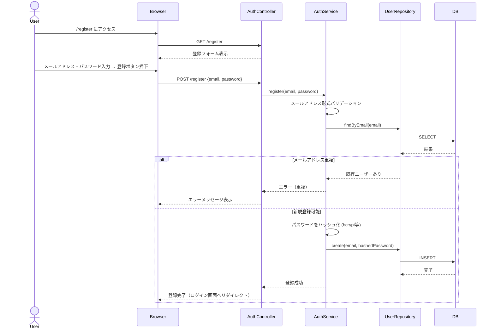
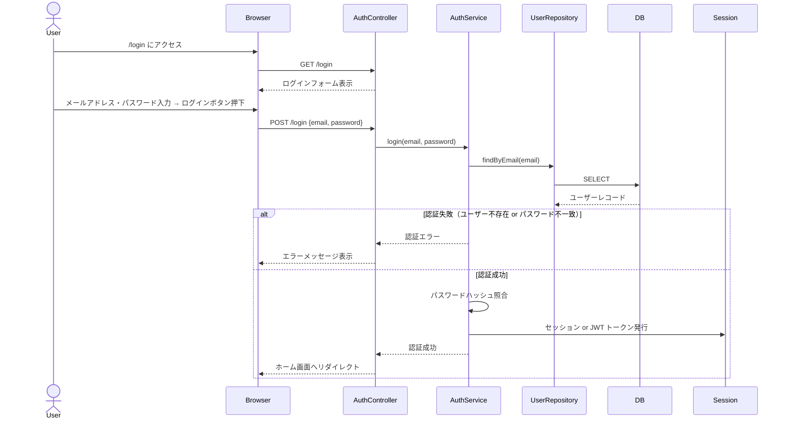

---
doc:
  id: 'arch:user-authentication'
  title: 'ユーザー認証 基本設計'
  type: 'architecture'
  status: 'active'
  derives_from:
    - ref: 'spec:user-authentication'
      relation: 'implements'
  updated: '2026-04-08'
---

# ユーザー認証 基本設計

## 概要

メールアドレスとパスワードを用いたユーザー登録・ログイン機能の設計。
Web アプリとして `/register` および `/login` エンドポイントを提供し、認証成功後はセッションまたは JWT トークンによりログイン状態を維持する。

## 設計内容

### コンポーネント構成

```
[ブラウザ]
   │
   ▼
[Webサーバー / ルーティング]
   ├── GET  /register  → RegisterPage (登録フォーム)
   ├── POST /register  → AuthController#register
   ├── GET  /login     → LoginPage (ログインフォーム)
   └── POST /login     → AuthController#login
         │
         ▼
   [AuthService]
   ├── register(email, password): ユーザー作成・パスワードハッシュ化
   └── login(email, password):    照合・セッション/トークン発行
         │
         ▼
   [UserRepository]
   └── DB (usersテーブル)
```

### 処理フロー

#### ユーザー登録フロー



#### ユーザーログインフロー



### データモデル

**users テーブル**

| カラム名       | 型           | 制約                  |
|----------------|--------------|---------------------- |
| id             | UUID / INT   | PK, AUTO INCREMENT    |
| email          | VARCHAR(255) | UNIQUE, NOT NULL      |
| password_hash  | VARCHAR(255) | NOT NULL              |
| created_at     | TIMESTAMP    | NOT NULL, DEFAULT NOW |
| updated_at     | TIMESTAMP    | NOT NULL, DEFAULT NOW |

## 設計上の決定事項

| 決定事項 | 内容 | 根拠 |
|----------|------|------|
| パスワードハッシュアルゴリズム | bcrypt を使用 | ソルト付きハッシュで総当たり攻撃に耐性があり、広く採用されている標準的手法 |
| 認証状態の維持方式 | セッション Cookie または JWT トークンを採用 | Web アプリとして HTTP ステートレス環境でログイン状態を維持するために必要。実装スタックに応じて選択 |
| メールアドレスバリデーション | サーバーサイドで正規表現によるフォーマットチェック | クライアントサイドのみでは回避可能なため、サーバー側での検証を必須とする |
| 重複メールアドレスのエラー処理 | 登録時に DB の UNIQUE 制約 + アプリ層の事前チェックで検出 | 競合状態を考慮し DB 制約を最終防衛ラインとする |
| 認証失敗メッセージ | 「メールアドレスまたはパスワードが正しくありません」と汎用化 | ユーザー存在有無を露出するユーザー列挙攻撃を防止するため |
