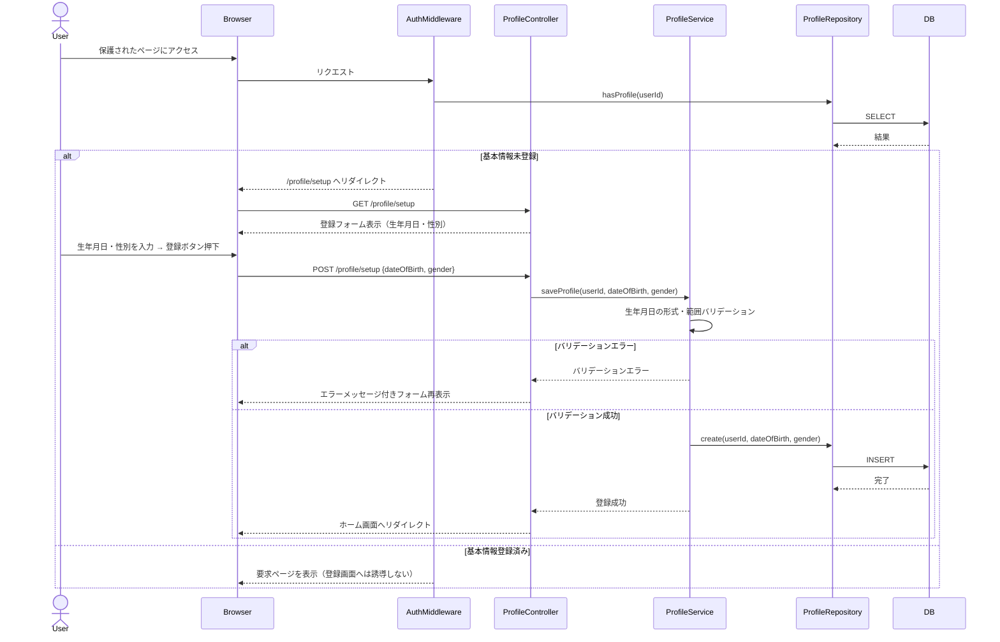

---
doc:
  id: 'arch:user-profile-registration'
  title: 'ユーザー基本情報登録 基本設計'
  type: 'architecture'
  status: 'active'
  derives_from:
    - ref: 'spec:user-profile-registration'
      relation: 'implements'
  updated: '2026-04-08'
---

# ユーザー基本情報登録 基本設計

## 概要

ログイン済みユーザーが生年月日・性別を登録する機能の設計。
ログイン後に基本情報の登録有無を確認し、未登録の場合はプロフィール登録画面へ誘導する。
登録完了後はホーム画面へ遷移する。

## 設計内容

### コンポーネント構成

```
[ブラウザ]
   │
   ▼
[Webサーバー / ルーティング]
   ├── GET  /profile/setup   → ProfileSetupPage (基本情報登録フォーム)
   └── POST /profile/setup   → ProfileController#create
         │
         ▼
   [ProfileService]
   └── saveProfile(userId, dateOfBirth, gender): 基本情報保存
         │
         ▼
   [ProfileRepository]
   └── DB (user_profilesテーブル)

[AuthMiddleware]
   └── ログイン済みチェック + 基本情報登録済みチェック → 未登録時に /profile/setup へリダイレクト
```

### 処理フロー

#### ログイン後の基本情報チェックフロー

```mermaid
flowchart TD
    A[ログイン成功] --> B{基本情報は登録済みか？}
    B -- 未登録 --> C[/profile/setup へリダイレクト]
    B -- 登録済み --> D[ホーム画面へ遷移]
    C --> E[基本情報登録フォーム表示]
```

#### 基本情報登録フロー



### データモデル

**user_profiles テーブル**

| カラム名      | 型           | 制約                  |
|---------------|--------------|---------------------- |
| id            | UUID / INT   | PK, AUTO INCREMENT    |
| user_id       | UUID / INT   | FK → users.id, UNIQUE, NOT NULL |
| date_of_birth | DATE         | NOT NULL              |
| gender        | VARCHAR(16)  | NOT NULL              |
| created_at    | TIMESTAMP    | NOT NULL, DEFAULT NOW |
| updated_at    | TIMESTAMP    | NOT NULL, DEFAULT NOW |

### 性別の選択肢

| 値          | 表示ラベル |
|-------------|-----------|
| male        | 男性      |
| female      | 女性      |
| other       | その他    |

## 設計上の決定事項

| 決定事項 | 内容 | 根拠 |
|----------|------|------|
| 基本情報チェックのタイミング | ログイン成功直後、およびミドルウェアによる各リクエスト時に確認 | ログイン後すぐに未登録ユーザーを誘導し、不完全な状態でアプリを利用させないため |
| 登録済みユーザーへの再表示防止 | ProfileRepository で登録有無を確認し、登録済みの場合は /profile/setup を表示しない | 誤操作や URL 直打ちによる二重登録・上書きを防止するため |
| 生年月日の入力形式 | `yyyy/mm/dd` 形式、サーバーサイドで形式・範囲バリデーションを実施 | UI 側の入力形式を統一し、不正な日付（例: 9999/99/99）の保存を防ぐ |
| 性別の保存形式 | 固定値（male / female / other）を DB に保存し、表示ラベルはアプリ側で変換 | 多言語対応や表示変更に対して DB を変更せず対応できるようにする |
| user_profiles と users の分離 | users テーブルとは別テーブルで管理 | 認証情報とプロフィール情報の責務を分離し、拡張性を高めるため |
| 登録完了後の遷移先 | ホーム画面（`/` または `/home`）へリダイレクト | 基本情報登録後は通常のアプリ利用フローへ移行させるため |
